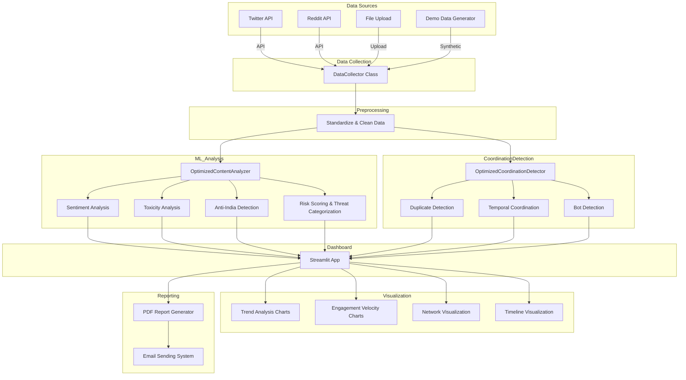

# Anti-India Campaign Detection System

[](https://anti-india-campaign-detection.streamlit.app/)

## Overview

An advanced **Anti-India Campaign Detection System** built with [Streamlit](https://streamlit.io/) for interactive dashboarding, machine learning-based content analysis, network graphing, and automated reporting. This system is designed to identify and analyze suspicious, coordinated, or high-risk social media activity targeting India, leveraging both Twitter and Reddit data sources.

🔗 **[Try Live Demo](https://anti-india-campaign-detection.streamlit.app/)**

---

## Core Features

- **Multi-source Data Collection:** Supports Twitter API, Reddit API, file uploads (CSV, JSON, Excel), and synthetic demo data
- **ML/NLP Analysis:** Uses transformer models for sentiment and toxicity detection, with rule-based systems for fallback
- **Coordination Detection:** Identifies duplicate, temporally coordinated, and bot-driven content using clustering, similarity, and statistical methods
- **Interactive Visualizations:** Advanced trend, engagement, and network graphs using Plotly with a fixed dark theme
- **PDF & Email Reporting:** Generates comprehensive PDF reports and sends them via email using built-in SMTP
- **Enhanced Dashboard:** Multi-tab dashboard for threat analytics, high-risk posts, coordination networks, bot analysis, and performance metrics

---

## Architecture

### High-Level Flow



---

## Module Breakdown

### Main Components

- **app.py**: Core application file containing all classes, logic, and UI
  - `DataCollector`: Data ingestion from APIs, uploads, and demo generation
  - `OptimizedContentAnalyzer`: ML/NLP model loading, batch analysis, rule-based fallback
  - `OptimizedCoordinationDetector`: Duplicate, temporal, and bot pattern detection
  - **Visualization Functions**: Trend, engagement, network, timeline, and summary charts
  - **Reporting Functions**: PDF report generation, email sending, and summary text

### ML Models

- [HuggingFace Transformers](https://huggingface.co/transformers/) for state-of-the-art NLP
  - `cardiffnlp/twitter-roberta-base-sentiment-latest` for sentiment analysis
  - `martin-ha/toxic-comment-model` for toxicity detection
- GPU acceleration support when CUDA is available

### Visualization & Reporting

- [Plotly](https://plotly.com/python/) for interactive charting with custom dark theme
- NetworkX for graph structure and network metrics
- [fpdf2](https://pypi.org/project/fpdf2/) for comprehensive PDF generation
- SMTP integration for automated email alerts

---

## Quick Start

### Installation

```bash
pip install streamlit torch transformers plotly networkx pandas numpy scikit-learn fpdf2 tweepy praw
```

### Run the Application

```bash
streamlit run app.py
```

Or visit the **[Live Demo](https://anti-india-campaign-detection.streamlit.app/)**

---

## Usage Guide

### 1. Select Data Source

Choose from multiple data sources:
- **Upload Dataset**: CSV, JSON, Excel files (up to 100MB)
- **Twitter API**: Requires Bearer Token for authentication
- **Reddit API**: Requires Client ID, Secret, and User Agent
- **Demo Data**: Generate synthetic data for quick testing

### 2. Analyze Data

- Use dashboard buttons to trigger ML analysis and coordination detection
- Navigate tabs for detailed results and insights
- Review threat analytics and high-risk content

### 3. Generate Reports

- Create comprehensive markdown or PDF reports
- Configure email settings in sidebar (Gmail App Password required)
- Send automated reports to stakeholders

---

## Customization

### Theme and Performance
Adjust dark theme settings and batch/visualization parameters via the sidebar for optimal performance.

### Keywords & Patterns
Customize anti-India and suspicious phrase lists in `OptimizedContentAnalyzer` to match specific detection requirements.

### Model Selection
Replace HuggingFace models with alternative pre-trained models as needed for your use case.

---

## Security & Privacy

**API Credentials**: All credentials entered in the sidebar are processed in-memory only and are not stored or logged.

**Data Handling**: Uploaded or collected data is processed exclusively in-memory and is never saved locally, ensuring privacy and security.

---

## Extending the System

- **Add New Models**: Extend `OptimizedContentAnalyzer` with additional ML models or threat detection patterns
- **Integrate APIs**: Add support for other social media platforms (Facebook, YouTube, Instagram) by subclassing `DataCollector`
- **Enhanced Reporting**: Implement HTML or Excel reporting formats using the existing reporting utilities

---

## Technical Stack

- **Frontend**: Streamlit
- **ML/NLP**: PyTorch, HuggingFace Transformers
- **Data Processing**: Pandas, NumPy, scikit-learn
- **Visualization**: Plotly, NetworkX
- **APIs**: Tweepy (Twitter), PRAW (Reddit)
- **Reporting**: fpdf2, SMTP

---

## License

MIT License

---

## Acknowledgments

- [HuggingFace Transformers](https://huggingface.co/transformers/)
- [Streamlit](https://streamlit.io/)
- [Plotly](https://plotly.com/python/)
- [NetworkX](https://networkx.org/)
- [scikit-learn](https://scikit-learn.org/)
- [fpdf2](https://pypi.org/project/fpdf2/)

---

## Support

For issues, feature requests, or questions:
- Open a GitHub issue in this repository
- Contact the maintainer via email

---

**Made with ❤️ for detecting and analyzing coordinated disinformation campaigns**
